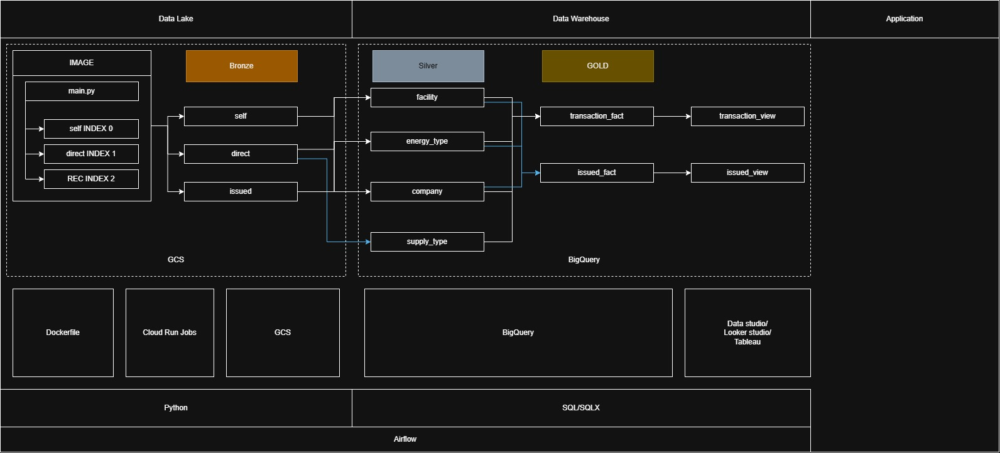
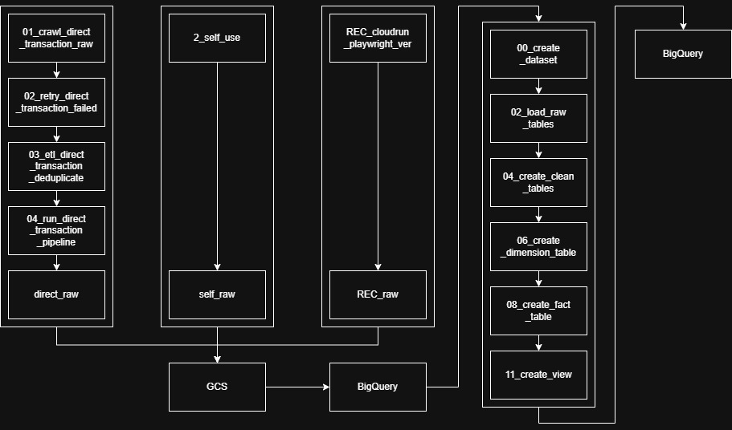

# 台灣綠能憑證交易資料工程平台

> 以現代資料工程技術棧，串接台灣 T-REC 綠能憑證交易資料，實現從爬蟲採集、雲端儲存、資料倉儲建模到自動化排程的端對端 Data Pipeline。


---

## 目錄

- [課程背景](#課程背景)
- [專案簡介](#專案簡介)
- [技術架構](#技術架構)
- [系統架構圖](#系統架構圖)
- [資料流程](#資料流程)
- [目錄結構](#目錄結構)
- [快速開始](#快速開始)
- [環境變數設定](#環境變數設定)
- [資料倉儲架構](#資料倉儲架構)
- [Airflow DAG 說明](#airflow-dag-說明)
- [CI/CD 流程](#cicd-流程)

---

## 課程背景

本專案為 **[Tibame](https://www.tibame.com/) TKR101 資料工程師養成班 — 第九期** 結業專題。

課程涵蓋資料工程核心技術棧，本專案以台灣再生能源憑證交易資料為題材，從零建立完整的 End-to-End 資料平台，驗證課程所學。

---

## 專案簡介

本專案以台灣[再生能源憑證（T-REC）](https://trec.taipower.com.tw/)交易資料為核心，建構一套完整的**雲端原生資料工程平台**，涵蓋三大資料來源的自動化採集、資料清洗、倉儲建模及視覺化分析。

### 資料來源

| 資料集 | 說明 |
|---|---|
| 直轉供憑證成交紀錄 | 企業向發電業者直接購買的 T-REC 交易明細 |
| 自用發電設備憑證 | 企業自建再生能源設備的憑證移轉紀錄 |
| 已發放憑證清冊 | 台電發放中的全數憑證現況總覽 |

### 技術亮點

- **瀏覽器自動化爬蟲**：以 Playwright 攔截網站 API，高效抓取 JavaScript 動態渲染頁面
- **Medallion 架構**：實作 Bronze → Silver → Gold 三層資料倉儲，確保資料品質與可追溯性
- **雙軌資料倉儲**：同時支援 BigQuery（雲端）與 MySQL（本地），適應不同開發情境
- **Airflow Asset-based 依賴**：以資料資產驅動工作流，自動在上游資料更新時觸發下游轉換
- **零金鑰 CI/CD**：透過 Workload Identity Federation 實現無長效憑證的安全部署

---

## 技術架構

### 程式語言與框架

| 類別 | 技術 |
|---|---|
| 主要語言 | Python 3.13 |
| 資料處理 | pandas 3.0+、SQLAlchemy 2.0+ |
| 瀏覽器自動化 | Playwright（主）、Selenium（舊版） |
| 視覺化 | Plotly 5.24+、Streamlit 1.40+ |
| 資料庫 | BigQuery、MySQL |

### Google Cloud Platform

| 服務 | 用途 |
|---|---|
| **Cloud Storage (GCS)** | 原始 CSV 資料湖（`tibame-bronze`） |
| **BigQuery** | 雲端資料倉儲，執行 Medallion 架構轉換 |
| **Cloud Run Jobs** | 無伺服器容器化爬蟲與 ETL 任務執行 |
| **Artifact Registry** | Docker 映像管理（`asia-east1`） |
| **Workload Identity Federation** | 無長效金鑰的 GitHub Actions 安全認證 |

### 排程與 DevOps

| 工具 | 用途 |
|---|---|
| Apache Airflow 3.2+ | DAG 工作流排程與 Asset 資料血緣 |
| GitHub Actions | CI/CD：自動建置映像並部署至 Cloud Run |
| Docker | 爬蟲與 BigQuery 處理各自獨立容器化 |

---

## 系統架構圖

### 整體技術架構

> Data Lake → Data Warehouse (Medallion) → Application Layer，以 Airflow 串接全流程



**架構說明：**
- **Data Lake (GCS)** — 以 Cloud Run Jobs 執行三隻爬蟲（`main.py` 統一入口，透過 Task Index 分派），將原始 CSV 落地至 `tibame-bronze` Bucket
- **Data Warehouse (BigQuery)** — Silver 層建立維度表（facility、energy_type、company、supply_type），Gold 層建立事實表與分析 View
- **Application** — 供 Looker Studio / Tableau / Data Studio 直接連接 BigQuery View 視覺化呈現
- **技術底座** — Python（爬蟲 + ETL）、SQL/SQLX（BigQuery 轉換）、Airflow（排程編排）、Dockerfile + Cloud Run（容器執行）

---

### Pipeline 執行流程

> 每個爬蟲 DAG 獨立執行，三個來源的原始資料全部到位後，Asset-based 觸發 BigQuery 轉換鏈



**流程說明：**

| 階段 | 爬蟲 DAG | 步驟 |
|---|---|---|
| 直轉供 | `dag_01_crawl_direct_transaction` | crawl → retry → deduplicate → pipeline → `direct_raw` |
| 自用發電 | `dag_2_self_use` | crawl → `self_raw` |
| 已發放憑證 | `dag_rec_cloudrun` | crawl → `REC_raw` |
| BigQuery 轉換 | `dag_bq_transform`（Asset 觸發） | 00_create_dataset → 02_load_raw → 04_clean → 06_dimension → 08_fact → 11_view |

---

## 資料流程

### 完整 ETL 流程

```
Step 01  爬蟲採集原始頁面資料 (Playwright)
   ↓
Step 02  重試失敗批次，確保資料完整性
   ↓
Step 03  去重處理，寫入 GCS CSV 檔案
   ↓
Step 04  GCS → BigQuery Raw Table (Bronze)
   ↓
Step 05  建立 Clean Table：資料型別轉換、空值標準化 (Silver)
   ↓
Step 06  建立維度表：公司、設備、能源類型、供應型態 (Gold)
   ↓
Step 07  建立事實表：fact_transaction、fact_issued_certificate (Gold)
   ↓
Step 08  建立分析 View：反正規化寬表，供 BI 工具直接查詢
```

### 資料清洗規則

| 函式 | 處理邏輯 |
|---|---|
| `clean_empty()` | 將空字串、`"-"`、`"—"`、`NaN` 統一轉為 `NULL` |
| `clean_text()` | 全形符號轉半形（`（`→`(`、`，`→`,`） |
| `clean_decimal()` | 解析千分位數字（`"1,234.56 MWh"` → `1234.56`） |
| `clean_date()` | 統一日期格式為 `YYYY-MM-DD` |

---

## 目錄結構

```
tibame/
├── .github/workflows/
│   └── cloud-run.yml          # GitHub Actions CI/CD
├── dags/                      # Airflow DAG 定義
│   ├── common_config.py       # 共用 GCP 設定（專案 ID、Bucket 等）
│   ├── dag_crawl_direct_transaction.py
│   ├── dag_crawl_self_use.py
│   ├── dag_crawl_rec.py
│   └── dag_bq_transform.py    # Asset-triggered BigQuery 轉換 DAG
├── src/
│   ├── crawler/               # 爬蟲模組
│   │   ├── direct_transaction_cloudrun_playwright/  # 直轉供（Playwright）
│   │   ├── self_generation_update/                  # 自用發電（Selenium）
│   │   └── REC_cloudrun_playwright_ver.py           # 已發放憑證（Playwright）
│   ├── database/
│   │   ├── csv_to_mysql.py
│   │   └── sql/               # MySQL Schema（Raw → Clean → Dim → Fact → View）
│   └── green_pipeline/
│       ├── BigQuery/STAR0/Python/  # BigQuery 00~11 步驟腳本
│       └── MySQL/                  # 本地 MySQL Pipeline 腳本
├── docs/                      # 技術文件與資料字典
├── bq.Dockerfile              # BigQuery 處理容器
├── crawler.Dockerfile         # 爬蟲容器
├── gcp_medallion_pipeline_dag.py
├── airflow-for-gcp.py
├── pyproject.toml
└── requirements.txt
```

---

## 快速開始

### 前置需求

- Python 3.13+
- [uv](https://docs.astral.sh/uv/)（套件管理）
- Google Cloud SDK（本地端 GCP 操作）
- Docker（容器化部署）

### 安裝依賴

```bash
# 使用 uv 建立虛擬環境並安裝套件
uv sync

# 或使用 pip
pip install -r requirements.txt
```

### 安裝 Playwright 瀏覽器

```bash
uv run playwright install chromium
```

---

## 環境變數設定

在專案根目錄建立 `.env` 檔案：

```dotenv
# MySQL 本地資料庫
MYSQL_HOST=localhost
MYSQL_PORT=3306
MYSQL_USER=root
MYSQL_PASSWORD=your_password
MYSQL_DATABASE=green_energy_exchange_db
MYSQL_CHARSET=utf8mb4

# Google Cloud Platform
GCP_PROJECT_ID=tibametopics
BQ_DATASET_ID=gcstobq_airflowtest
GCS_BUCKET=tibame-bronze

# 爬蟲設定
YEARS_TO_CRAWL=2026,2025       # 要採集的年份（逗號分隔）
MAX_PAGES_PER_YEAR=0           # 0 = 不限頁數
SAVE_EVERY_PAGES=10            # 每 N 頁存一次 checkpoint
HEADLESS=true                  # 無頭模式（Cloud Run 建議 true）
```

> **GCP 本地開發：** 設定 `GOOGLE_APPLICATION_CREDENTIALS` 指向服務帳戶 JSON 金鑰，或執行 `gcloud auth application-default login`。

---

## 資料倉儲架構

本專案採用**星型模型（Star Schema）**搭配 Medallion 分層架構：

### Bronze 層（原始資料）

| 資料表 | 說明 |
|---|---|
| `trec_direct_transaction_raw` | 直轉供成交紀錄（全欄位 VARCHAR，保留原始格式） |
| `trec_self_generation_transaction_raw` | 自用發電憑證移轉紀錄 |
| `trec_issued_certificate_raw` | 已發放憑證清冊 |

### Silver 層（清洗後）

Bronze 資料經型別轉換、空值處理後存入 Clean Table，欄位型別對應實際語義（`DATE`、`DECIMAL` 等）。

### Gold 層（維度 + 事實）

```
dim_company      ─────┐
dim_facility     ─────┤
dim_energy_type  ─────┼──▶  fact_transaction
dim_supply_type  ─────┘     fact_issued_certificate
```

| 維度表 | 說明 |
|---|---|
| `dim_company` | 賣方、買方、憑證持有單位名稱 |
| `dim_facility` | 發電設備（名稱、地址、裝置容量） |
| `dim_energy_type` | 能源類型（太陽能、風力等） |
| `dim_supply_type` | 供應型態（直轉供、自用） |

### 分析 View

- `vw_transaction_detail`：事實表 JOIN 維度表的反正規化寬表
- `vw_issued_certificate_detail`：憑證清冊分析寬表

---

## Airflow DAG 說明

### DAG 架構設計原則

- 每個 DAG 各自獨立，職責單一，降低耦合
- 爬蟲 DAG 以 `@daily` 排程執行
- 轉換 DAG 以 **Asset-based 觸發**：三個原始資料表全部更新後才執行 BigQuery 轉換，確保資料完整性

### DAG 清單

| DAG | 排程 | 說明 |
|---|---|---|
| `dag_01_crawl_direct_transaction` | `@daily` | 採集直轉供紀錄（4 步驟序列） |
| `dag_2_self_use` | `@daily` | 採集自用發電憑證 |
| `dag_rec_cloudrun` | `@daily` | 採集已發放憑證清冊 |
| `dag_bq_transform` | Asset 觸發 | 執行 BigQuery 完整轉換鏈（00 → 10） |

### 執行流程示意

```
dag_01_crawl  ──▶ GCS Asset 更新 ─┐
dag_2_self    ──▶ GCS Asset 更新 ─┼──▶ dag_bq_transform ──▶ BigQuery Gold 層
dag_rec       ──▶ GCS Asset 更新 ─┘
```

### Cloud Run 動態覆寫

爬蟲與 ETL 步驟均以 Cloud Run Job 執行，透過環境變數 `SCRIPT_PATH` 動態指定要執行的腳本，實現單一容器映像多腳本複用。

---

## CI/CD 流程

### GitHub Actions 自動部署

**觸發條件：** Push 至 `main` 分支

```
Checkout 程式碼
    ↓
GCP 身份驗證（Workload Identity Federation）
    ↓
建置 Docker 映像
    ↓
推送至 Artifact Registry（asia-east1）
    ↓
部署至 Cloud Run（asia-east1，Project: tibametopics）
```

### Workload Identity Federation

使用 OIDC 實現零長效金鑰部署，GitHub Actions 無需儲存任何 GCP 服務帳戶 JSON，顯著降低憑證洩漏風險。

---

## 專案亮點總結

| 面向 | 實作內容 |
|---|---|
| 資料採集 | Playwright API 攔截、分頁爬蟲、checkpoint 斷點續傳 |
| 資料品質 | 四類清洗函式、三層 Medallion 資料驗證 |
| 雲端架構 | GCS Data Lake + BigQuery DW 雙層雲端儲存 |
| 排程設計 | Airflow Asset 依賴、解耦多 DAG、Cloud Run 動態執行 |
| DevOps | GitHub Actions + Workload Identity Federation 零金鑰 CI/CD |
| 延展性 | 雙軌倉儲（BigQuery / MySQL），支援雲端與本地開發 |
